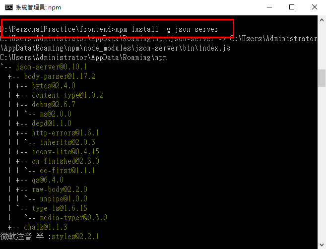
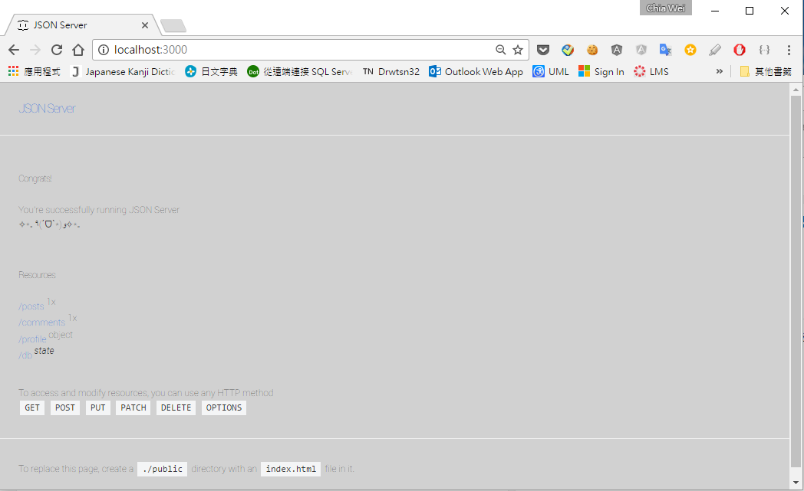
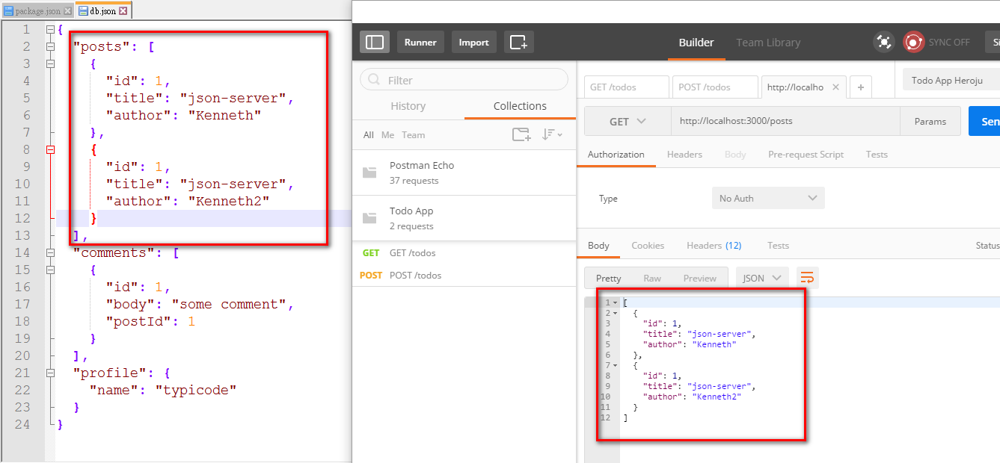
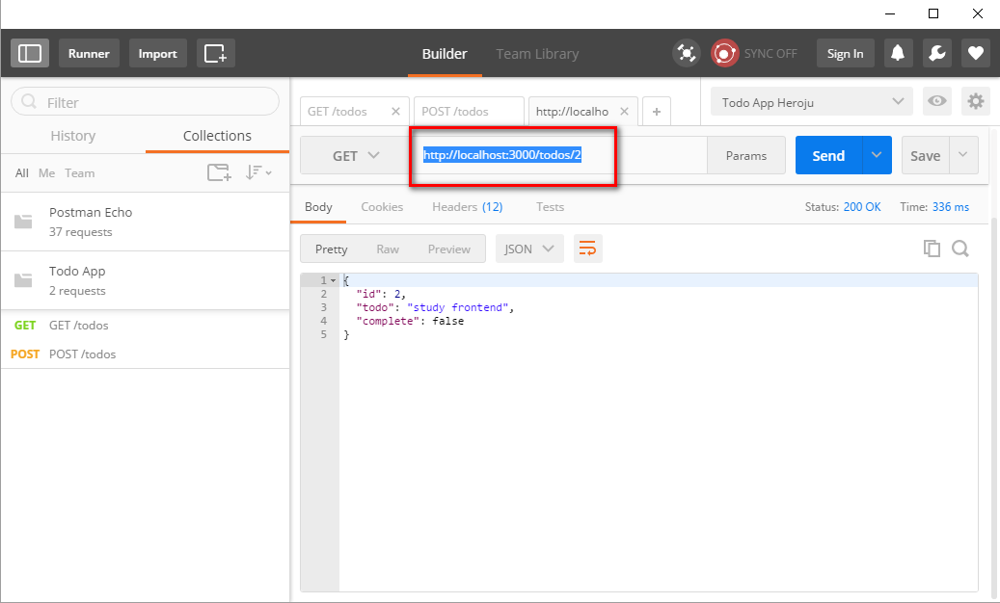
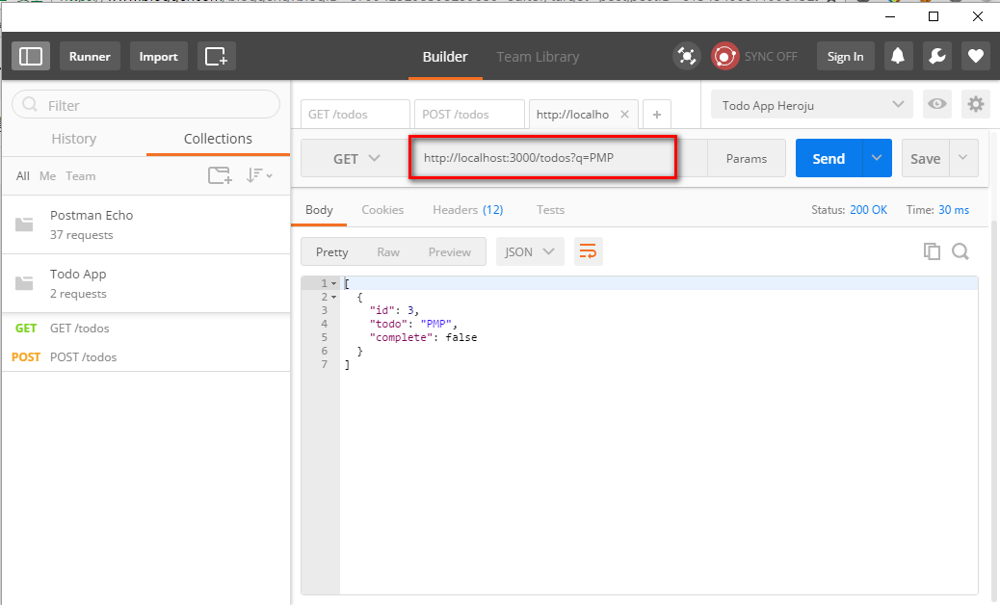
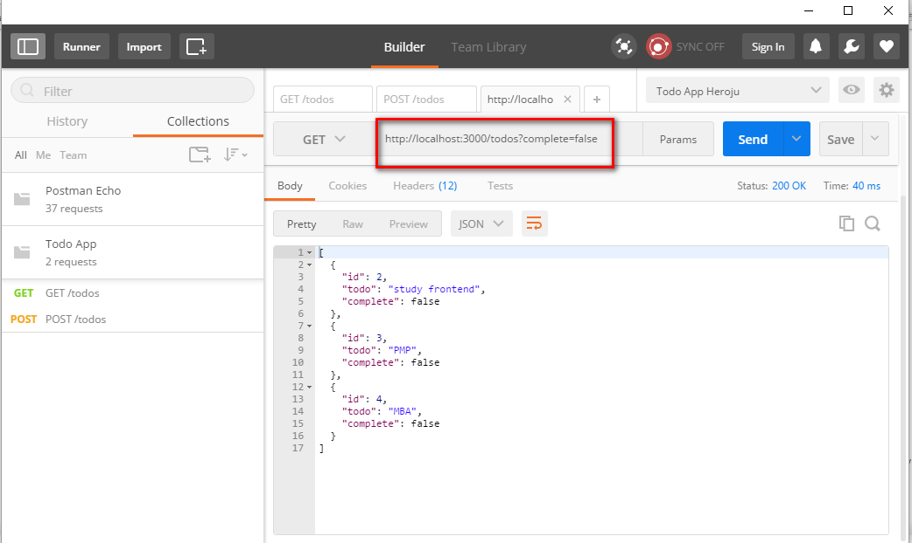
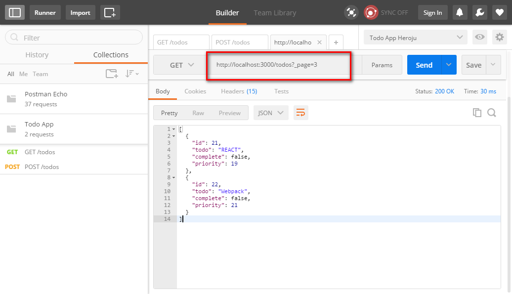
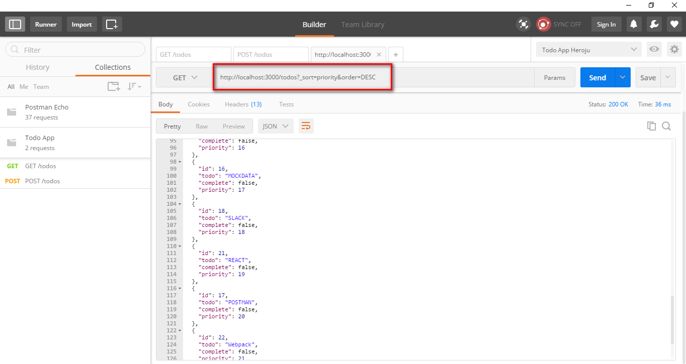

# How to Use json-server 


Serverr : https://github.com/typicode/json-server

## Installation
1. Install package.

```
   -  npm install -g json-server
```

 
 
2. start service

```
   - json-serevr -- watch db.json
```
     * after run instruction, it will generate a json database : db.json


3. open browser and type - localhost:3000

```
   http://localhost:3000
```   
 
 
 
4. try to get posts resource by postman.


 

## JSON-SERVER support HTTP operation method

   GET
   DELETE
   POST
   PUT
   PATCH


## Features

```
{
  "todos": [
    {
      "id": 1, 
      "todo": "study json-server", 
      "complete":"true"
    },
    {
       "id": 2, 
      "todo": "study frontend", 
      "complete":"false"
    },
    {
       "id": 3, 
      "todo": "PMP", 
      "complete":"true"
    },
    {
       "id": 4, 
      "todo": "MBA", 
      "complete":"false"
    }
  ]
}
```


1. ID
We need to post this data without specifying an ID in the URI, but add it in the data. To check if this was successfully added, send a GET request to the server:

```
http://localhost:3000/todos/2
```

 

 
 2. Search
You can search within a resource for relevant results. For example, in the todos API, if you want to search for the word "PMP", then you need to add an optional parameter q to your URI:

```
http://localhost:3000/todos?q=PMP
```

 

 

3. Filters
You can apply filters to your requests again using the ? sign. The q filter is reserved for search as we've seen above.

If you want to get the uncompleted list, you can send a GET request to your resource URI appending it with a ? followed by the property complete you want to filter with and its value:

```
http://localhost:3000/todos?complete=false
```

 

 
 
4. Pagination
json-server, by default, provides pagination support with 10 items per page. Pagination comes in handy when prototyping apps that'll have pages or will load data when scrolling.

For example, if you want to access page 3 of your todos's API, send a GET request:value:

```
http://localhost:3000/todos?_page=3
```

 


5. Sorting
It also allows you to request sorted data from your API. Use the _sort and _order properties for specifying the property on whose basis you want to sort and the order in which you want to sort it respectively. If you are sorting on a text field, the entries would be sorted alphabetically.

For example, if you want the list of todos to be sorted in descending order of ratings, then you'll send a GET request:

```
http://localhost:3000/todos?_sort=priority&order=DESC
```


 


## License

DataTables is release under the [MIT license](//datatables.net/license). You are free to use, modify and distribute this software, as long as the copyright header is left intact (specifically the comment block which starts with `/*!`.
